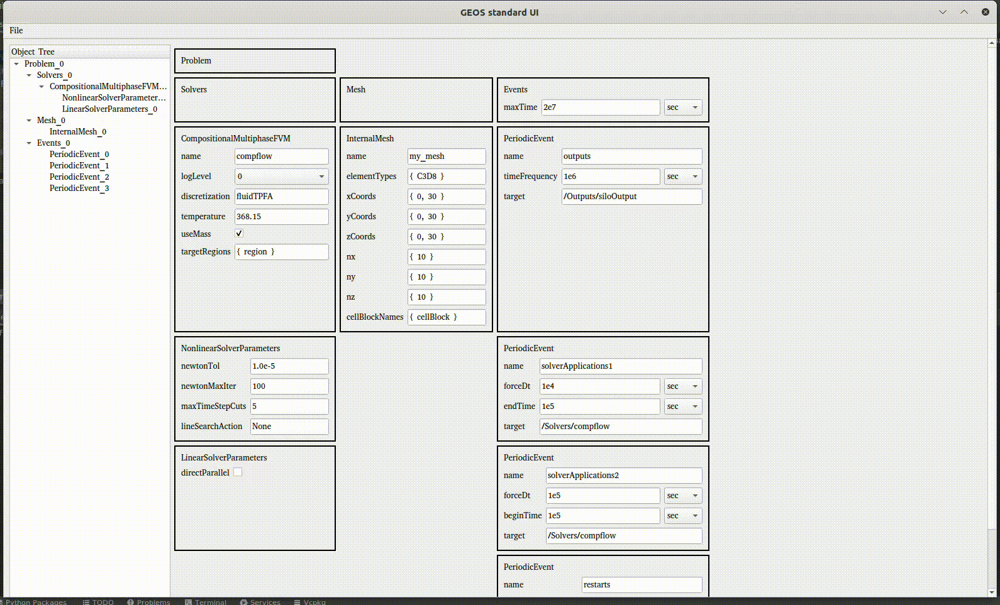
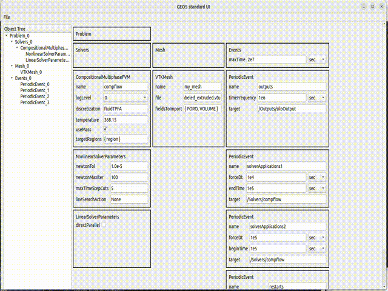
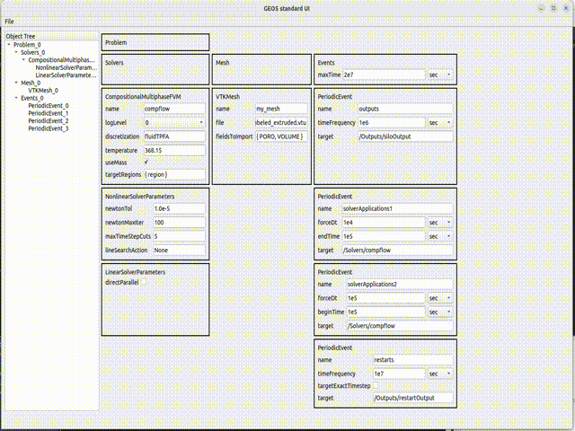

# UI

## Requirements

In order to install all packages required by the converter, please run

    pip3 install -r requirements.txt

## Launch GUI

Once env set-up, run the following command to launch the GUI

    python3 code.py

## Features

GUI is capable of opening file (by default `test.xml` at the repo root) under menu `File > Open`.
Values are editables, specific widget has been added to help with systematic values ( _e.g._ combos for log).
Nodes can be filtered via selection in the worktree on the left and validation (double-click or press enter).

It also offers `File > Reset to default` that reset the file to the maximum xml as generated by the schema,
that means the xml composed of same nodes with all attribute with their default values. By right-click context
menu `Reduce`, it also allows to reduce attributes, discarding those at default values according to the schema file
`schema.xsd`. Then attribute can be added by context menu right-click `Augmente`.

Eventually it offers conversion from hours, days, year to seconds via combo selection.
Once happy with the file, `File > Save as ...` is saving formatted xml using GEOS python tool.

## Timeline view for Event (New)

A dynamic timeline view of _Events_ can be obtained through context menu. It display Gantt chart
like events which can be moved forward or backward of 100 sec by left or right clicking on them.
A middle click will half the duration of the event.

## VTK view for VTKMesh (New)

A dynamic VTK rendering for _VTKMesh_ can be obtained through context menu. It display vtk fields in
the vtk mesh pointed by the filename path along with some info (range, average and standard deviation of the
displayed fields). It has a screenshot button. 

It also integrates some of the _meshDoctor_ feature (volume check), which if activated will display
infringing cells in Misty rose color and passing cell with the color of the previously displayed field.

